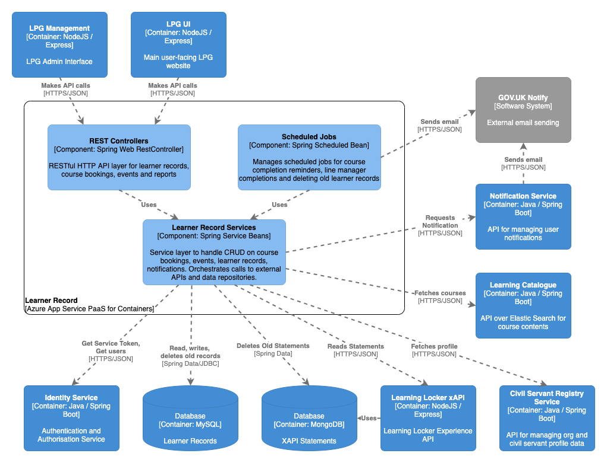

# Learner Record API

## Purpose

Spring Boot based RESTful API for accessing a user's learner record data: view courses started and completed, manage learning plan, manage events and bookings, report on course bookings and course completion.

Also contains three scheduled jobs: for notifying line managers about incomplete required learning, for notifying line managers about completed learning, and to delete old user data.

## Component overview

See the `diagram/` folder for diagram source in draw.io XML format

## Dependencies

### Build-time

For a complete list of build dependencies check the `build.gradle` file. The main source dependencies are:  
- Spring Boot 2.0 (web, jersey, security, jdbc, cache, config)
- Spring Data JPA 2.0.5
- Spring Security OAuth2 2.3.3
- Spring Security JWT 1.1.1
- h2 database (in-memory DB for local development) 1.4

### Test-time

For a complete list of test dependencies check the `build.gradle` file. The main test dependencies are:  
- Spring Boot Starter Test
- Spring Boot Security Test
- mockito 2.8
- powermock 1.7

### Runtime 

#### Other LPG Services

- `identity-service` for creating a JWT token for cross-service requests and retrieving user identity data
- `civil-servant-registry-service` for getting civil servant user data
- `learning-catalogue` for fetching the list of required learning for a user's organisation
- `notification-service` for sending emails for course completion and event reminder
- `learning-locker-xapi` for recording booking approval and registration

#### External integrations

- `GOV.UK Notify` for sending email notifications from the batch jobs

#### Data Stores

- MySQL <version> for CRUD actions on learner record, booking and event data
- MongoDB <version> (CosmosDB) for accessing Learning Locker-created experience statements

#### Data migrations

The learner-record application uses Flyway to manage the DB migrations inside its own schema. See the `src/main/resources/db/migration` folder. Note: in-memory H2 DB has a separate migration folder than the deployed target MySQL DB - changes must be made to both in order to run successfully when deployed to the real environments.

## Build, run, test, deploy

The application requires Java 8 (OpenJDK 8) installed to build and run.

Build the application using Gradle `./gradlew build`.

Run the project with `./gradlew bootRun` or import the project into your IDE of choice such as IntelliJ or VS Code use the IDE commands to Run Application.

Test using `./gradlew test` or choose individual test classes or packages using your IDE.

The application is packaged as a docker container image and includes an Azure App Insights Java agent for collecting metrics from the app - see `Dockerfile` in the root directory for the container definition. `hammer` is the log collector used for aggregating log output.

The application also inclues a `Jenkinsfile` to define the Jenkins build pipeline stages and linking it to the docker image repository and correct terraform module.

Deployment is controlled via the Terraform scripts in the main PaaS repository, with per-environment configuration values referenced there and secrets injected from keybase.

## Configuration

Significant configuration properties are highlighted here. For the full configuration file see `src/main/resources/application.yml`

- `spring.datasource` connection settings for learner record's own MySQL database
- `spring.data.mongodb` the connection settings for accessing the Learning Locker Mongo database (currently Azure CosmosDB in Mongo compatibility mode in production)
- `notifications` notification service and path
- `xapi` connection settings for Learning Locker xAPI
- `oauth` connection settings for the identity-service used to create bearer tokens
- `identity` paths for retrieving identity data from the identity-service
- `registry` connection settings for the civil-servant-registry-service
- `lpg-ui` URLs for linking back to resources hosted on the main lpg-services frontend

## Licenses

Learner record is licensed by the MIT license, see `LICENSE` in the root folder for details. Dependent applications are licensed as according to their respective readme and license files.

